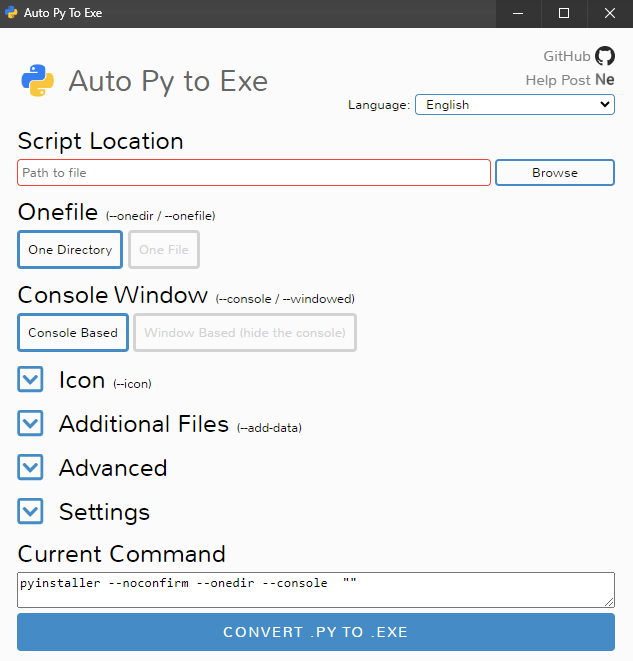

## Working Owl

Teniendo el proyecto instalado y las dependencias necesarias siga los pasos a continuación para la generación de un 
archivo `.exe`.

### 1. auto-py-to-exe

Abre una terminal y dirígete a la ruta donde se encuentra python. 
Generalmente esta acción se realiza ejecutando: `cd .\venv\Scripts`

Desde esta ruta ejecuta: `.\python.exe -m auto_py_to_exe`

Se abrirá la siguiente ventana:

### 2. Generación del .exe

Define en el Browser la ruta a [main.py](main.py):

Define el parámetro One-File a One File

Despliega las opciones de icono y añade el icono del [búho](animal.ico) (u otro archivo `.ico`)

Despliega las opciones avanzadas y pon el nombre que desees, usualmente es *WorkingOwl*.

Despliega los ajustes y define la ruta de salida.

Dale al botón grande, gordo y azul y espera un par de minutos.

### 3. Uso

Haz doble click sobre el `.exe` generado. 

- Si se abre una terminal: enhorabuena has generado con éxito el archivo!
- Si no se abre quizás sea porque el CAU o el anti-virus haya considerado que has cometido varios crímenes contra Yugoslavia. Puedes probar a cambiar el nombre.

